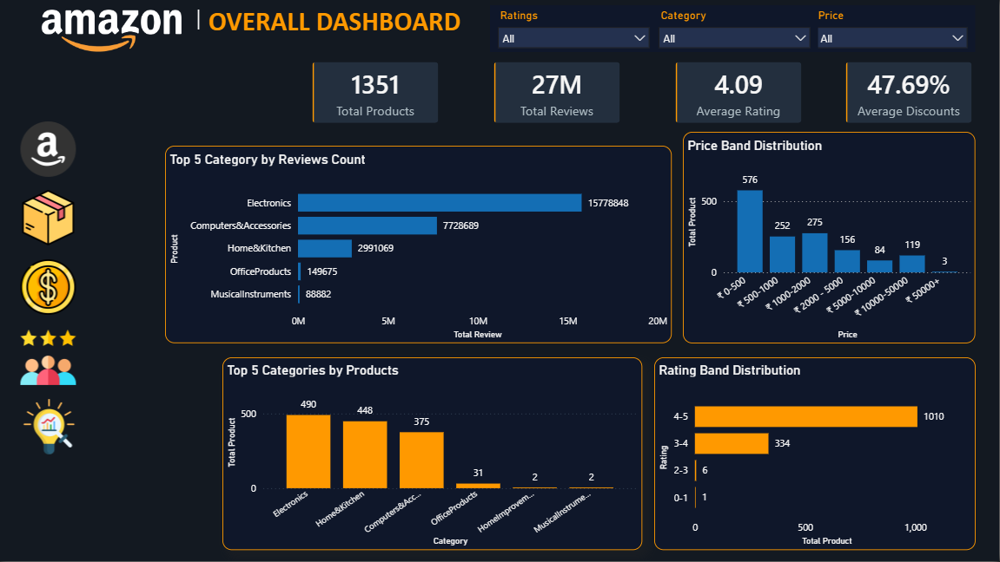

# 🛒 Amazon Product Analytics Dashboard | Power BI

An end-to-end **Amazon Product Analytics Dashboard** built in **Power BI** to analyze product performance, customer engagement, pricing behavior, discount effectiveness, and customer satisfaction across Amazon’s product marketplace. The project transforms raw product and review data into actionable business insights through interactive dashboards and DAX-driven analytics.

The dashboard analyzes **1,351 unique products** and **27M+ customer reviews**, providing a comprehensive view of category performance, pricing strategy, and customer sentiment.

## 📊 Dashboard Overview

### 1. Overall Dashboard


### 2. Category Performance


### 3. Pricing & Discount Analysis


### 4. Customer Satisfaction


### 5. Key Insights


## 📌 Project Highlights

* 📦 **1,351 unique products analyzed**
* ⭐ **27M+ customer reviews**
* 📈 **5 interactive dashboard pages**
* 🧮 Advanced **DAX measures and calculated columns**
* 🎨 Amazon-inspired **dark theme dashboard design**
* 💡 Executive-level business insights and recommendations

---

# 📑 Table of Contents

* [Project Overview](#-project-overview)
* [Business Questions](#-business-questions)
* [Dashboard Pages](#-dashboard-pages)
* [Key Insights](#-key-insights)
* [Tools & Technologies](#-tools--technologies)
* [Data Preparation](#-data-preparation)
* [DAX Calculations](#-dax-calculations)
* [Business Recommendations](#-business-recommendations)
* [Project Structure](#-project-structure)
* [Screenshots](#-screenshots)
* [Author](#-author)

---

# 📖 Project Overview

This project was developed to simulate a real-world e-commerce analytics scenario. The objective was to build a professional Power BI dashboard that helps stakeholders understand:

* Which categories drive the highest customer engagement
* What price ranges customers prefer most
* How discount strategies vary across categories
* Which products and categories have strong customer satisfaction
* Where hidden business opportunities exist

The final dashboard consists of **five analytical pages** designed for executive reporting and business decision-making.

---

# ❓ Business Questions

* Which product categories generate the highest engagement?
* What is the preferred customer price range?
* Which categories offer the highest discounts?
* How satisfied are customers with products?
* Which products are hidden opportunities for promotion?
* Which categories require quality improvement?

---

# 📊 Dashboard Pages

## 1️⃣ Overall Dashboard

Provides a high-level summary of marketplace performance.

### KPIs

* Total Products
* Total Reviews
* Average Rating
* Maximum Discount %

### Key Insight

The marketplace contains **1,351 products** and **27M+ reviews** with an overall average rating of **4.09/5**. Nearly **42.6% of products are priced below ₹500**, making the lower-price segment the largest part of the catalog.

---

## 2️⃣ Category Performance Analysis

Evaluates category-level engagement and market share.

### Key Insight

* **Electronics** dominates with **15.78M reviews** and **36.27% market share**.
* **Home & Kitchen** contributes **33.16%** of products.
* **Wireless Earbuds & Adapters** is the most-reviewed subcategory with **727K+ reviews**.

Electronics is the strongest category by customer engagement and market presence.

---

## 3️⃣ Customer Satisfaction Analysis

Measures customer sentiment and product quality.

### Key Insight

* **74.76% of products** have ratings between **4–5 stars**.
* **Home & Kitchen** has the highest number of low-rated products (**21 products**).
* **USB Cables** is the most-rated subcategory with **967 ratings**.

Overall satisfaction is strong, but Home & Kitchen requires attention.

---

## 4️⃣ Pricing & Discount Analysis

Analyzes pricing behavior and discount effectiveness.

### Key Insight

* Products priced **₹0–500 generate 9.78M ratings**, the highest engagement among all price bands.
* **Home Improvement** offers the highest average discount (**57.50%**).
* The largest savings segment is **₹0–499** with **428 products**.

Affordable products drive the strongest customer engagement.

---

## 5️⃣ Business Insights & Recommendations

Consolidates findings into strategic business actions.

### Executive Summary

* Electronics is the primary driver of marketplace engagement.
* Customer satisfaction is generally high.
* Lower-priced products outperform premium products in engagement.
* Discounting remains a significant sales driver.
* Quality improvement in Home & Kitchen represents a growth opportunity.

---

# 💡 Key Insights

| Insight                       | Finding                     |
| ----------------------------- | --------------------------- |
| Strongest Category            | Electronics                 |
| Market Share Leader           | Electronics (36.27%)        |
| Highest Engagement Price Band | ₹0–500                      |
| Highest Average Discount      | Home Improvement (57.50%)   |
| Overall Average Rating        | 4.09 / 5                    |
| Products Rated 4–5            | 74.76%                      |
| Largest Savings Segment       | ₹0–499                      |
| Most Reviewed Subcategory     | Wireless Earbuds & Adapters |

---

# 🛠 Tools & Technologies

| Tool            | Purpose                        |
| --------------- | ------------------------------ |
| **Power BI**    | Dashboard Development          |
| **Power Query** | Data Cleaning & Transformation |
| **DAX**         | KPI & Measure Creation         |
| **Excel**       | Initial Data Exploration       |

---

# 🧹 Data Preparation

The dataset was cleaned and transformed using Power Query and DAX.

### Transformations Performed

* Removed duplicate product records
* Standardized numeric fields
* Created **Main Category** and **Subcategory**
* Created **Price Bands**
* Created **Rating Bands**
* Calculated **Saving Amount**
* Created **Savings Bands**
* Created **Product Opportunity Segments**
* Added custom sorting columns for visuals

---

## 🧮 DAX Calculations

DAX (Data Analysis Expressions) was used extensively throughout this project to create dynamic KPIs, calculated columns, and analytical measures. These calculations enabled interactive filtering, category-level comparisons, pricing analysis, customer engagement tracking, and customer satisfaction measurement across all dashboard pages.

### Core KPI Measures

```DAX
Total Products =
DISTINCTCOUNT('amazon'[product_id])

Total Reviews =
SUM('amazon'[rating_count])

Avg Rating =
ROUND(AVERAGE('amazon'[rating]), 2)

Avg Discount % =
ROUND(AVERAGE('amazon'[discount_pct]), 2)
```

### Category Analysis Measures

```DAX
Total Categories =
DISTINCTCOUNT('amazon'[main_category])

Reviews per Product =
DIVIDE([Total Reviews], [Total Products])

Category Market Share % =
DIVIDE(
    DISTINCTCOUNT('amazon'[product_id]),
    CALCULATE(
        DISTINCTCOUNT('amazon'[product_id]),
        ALL('amazon'[main_category])
    )
)
```

### Pricing Analysis Measures

```DAX
Avg Sale Price =
ROUND(AVERAGE('amazon'[sale_price]), 0)

Avg Original Price =
ROUND(AVERAGE('amazon'[original_price]), 0)

Max Discount % =
MAX('amazon'[discount_pct])

Avg Discount =
AVERAGE('amazon'[discount_pct])
```

### Customer Satisfaction Measures

```DAX
Low Rated Products =
CALCULATE(
    DISTINCTCOUNT('amazon'[product_id]),
    'amazon'[rating] < 3.5
)

Hidden Winners =
CALCULATE(
    DISTINCTCOUNT('amazon'[product_id]),
    FILTER(
        'amazon',
        'amazon'[rating] >= 4.3
            && 'amazon'[rating_count] < AVERAGE('amazon'[rating_count])
    )
)

Overpriced Products =
CALCULATE(
    DISTINCTCOUNT('amazon'[product_id]),
    FILTER(
        'amazon',
        'amazon'[sale_price] > AVERAGE('amazon'[sale_price])
            && 'amazon'[rating] < AVERAGE('amazon'[rating])
    )
)
```

### Calculated Columns

```DAX
saving_amount =
'amazon'[original_price] - 'amazon'[sale_price]

rating_band =
SWITCH(
    TRUE(),
    'amazon'[rating] < 1, "0-1",
    'amazon'[rating] < 2, "1-2",
    'amazon'[rating] < 3, "2-3",
    'amazon'[rating] < 4, "3-4",
    "4-5"
)
```

These DAX calculations formed the analytical backbone of the dashboard and enabled real-time business insights across category performance, pricing strategy, customer engagement, and customer satisfaction.


---

# 📈 Business Recommendations

Based on the analysis, the following strategic recommendations can help improve marketplace performance and customer experience:

### Electronics

* Increase inventory availability and promotional focus, as Electronics is the strongest category by engagement and market share.

### Home & Kitchen

* Investigate product quality issues and customer feedback, since this category has the highest number of low-rated products.

### Pricing Strategy

* Continue emphasizing products priced below **₹500**, as they generate the highest customer engagement and review activity.

### Discount Strategy

* Optimize discount campaigns by benchmarking high-performing categories such as **Home Improvement** and **Computers & Accessories**.

### Product Promotion

* Promote high-rated but low-visibility products (hidden winners) to improve product discovery and conversion.

---

# 🏆 Final Business Conclusion

**Amazon’s marketplace performance is driven primarily by Electronics and affordable products, supported by strong overall customer satisfaction. Improving low-rated products in Home & Kitchen and optimizing discount strategies could create additional growth opportunities and strengthen customer experience.**

---

# 📁 Project Structure

```text
amazon-product-analytics-dashboard/
│
├── data/
│   └── amazon_cleaned.xlsx
│
├── dashboard/
│   └── amazon_product_analytics.pbix
│
├── images/
│   ├── overall_dashboard.png
│   ├── category_analysis.png
│   ├── customer_satisfaction.png
│   ├── pricing_analysis.png
│   └── business_insights.png
│
└── README.md
```

---
# Screenshots
## 🖼 Screenshots

### Overall Dashboard


### Category Performance Analysis


### Customer Satisfaction Analysis


### Pricing & Discount Analysis


### Business Insights & Recommendations

---

# 🚀 How to Use

1. Download the repository.
2. Open the `.pbix` file in **Power BI Desktop**.
3. Refresh the data source if prompted.
4. Use the interactive slicers to explore categories, price bands, and customer behavior across all dashboard pages.

---

# 👨‍💻 Author

**Abhishek Kumar**
Aspiring Data Analyst | Power BI | SQL | Excel

If you found this project useful, feel free to ⭐ star the repository and connect with me on LinkedIn.
